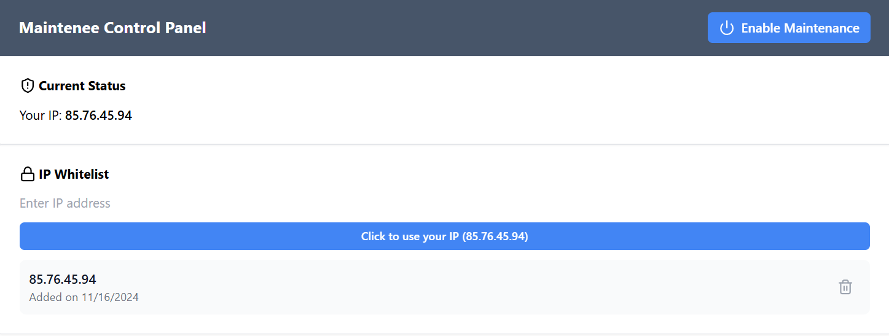

# Maintenee
A powerful open-source enable maintenance mode software with an easy-to-use dashboard and whitelisting access capabilities for your websites. 

### Integration
Add this script tag to your website's HTML:
```html
<script src="http://localhost:8080/maintenance.js"></script>
```

### Prerequisites
Please make sure that [Node.js](https://nodejs.org/en) (version >= 16) is installed on your operating system.

### Setup
With [pnpm](https://pnpm.io/) installed, you can run the project with the following commands in your OS
```node
$ git clone https://github.com/devmailar/maintenee.git
$ cd maintenee
$ pnpm install
$ pnpm dev
```
Access the admin panel http://localhost:5173 or the API service at http://localhost:8080

### Features
| Feature                       | Description                                                                 |
|-------------------------------|-----------------------------------------------------------------------------|
| **Maintenance Mode Toggle**   | Easily enable or disable maintenance mode for your website.                |
| **IP Whitelisting**           | Allow specific IPs to bypass maintenance mode.                             |
| **Real-time Status Updates**  | Instantly update the website's status for users.                           |
| **Seamless Integration**      | Integrate effortlessly with any website framework or platform.             |
| **Admin Management Panel**    | Control maintenance mode and manage whitelisted IPs through an admin UI.   |

### API Endpoints
| Method                        | Endpoint                                                                    |
|-------------------------------|-----------------------------------------------------------------------------|
| **GET**                       | http://localhost:8080/maintenance.js                                       |
| **GET**                       | http://localhost:8080/maintenance/get                                      |
| **GET**                       | http://localhost:8080/maintenance/whitelist/get                            |
| **POST**                      | http://localhost:8080/maintenance/toggle                                   |
| **POST**                      | http://localhost:8080/maintenance/whitelist/create                         |
| **DELETE**                    | http://localhost:8080/maintenance/whitelist/del/:ip                        |
